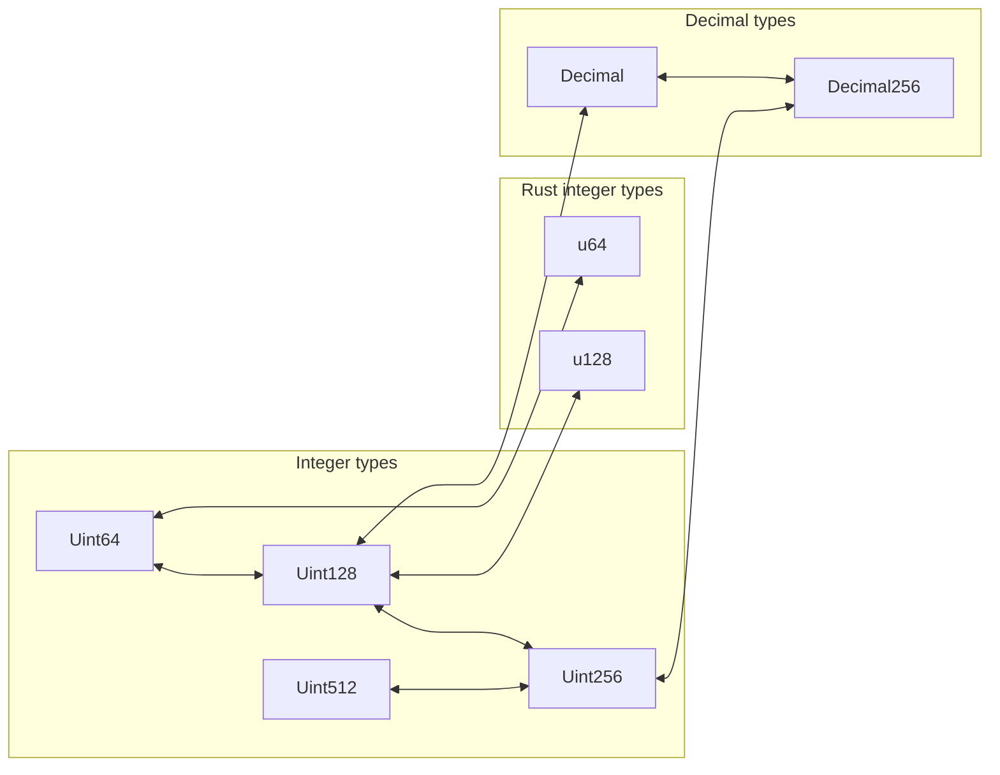

# Math

CosmWasm offers mathematical primitives for, you guessed it, mathematical operations. In contrast to
the Rust standard library, which is limited to 128-bit integers, we offer [integers] that exceed
that precision. [decimals] for fixed point math are also available.

## Conversions

The following overview shows how to convert between integers and decimals of different size. This
only shows the unsigned case but the signed types work the same way.

| Destination type | Source type: Decimal               |
|-----------------:|:-----------------------------------|
|       Decimal256 | From                               |
|           Uint64 |                                    |
|          Uint128 | ::to_uint_floor ::to_uint_ceil |
|          Uint256 |                                    |
|          Uint512 |                                    |
|              u64 |                                    |
|             u128 |                                    |

|                |              Decimal               |             Decimal256             | Uint64 |       Uint128       |       Uint256       | Uint512 | u64 | u128 |
|---------------:|:----------------------------------:|:----------------------------------:|:------:|:-------------------:|:-------------------:|:-------:|:---:|:----:|
|    **Decimal** |                 =                  |              TryFrom               |        | ::from_atomics(n,0) |                     |         |     |      |
| **Decimal256** |                From                |                 =                  |        |                     | ::from_atomics(n,0) |         |     |      |
|     **Uint64** |                                    |                                    |   =    |                     |                     |         |     |      |
|    **Uint128** | ::to_uint_floor ::to_uint_ceil |                                    |        |          =          |                     |         |     |      |
|    **Uint256** |                                    | ::to_uint_floor ::to_uint_ceil |        |                     |          =          |         |     |      |
|    **Uint512** |                                    |                                    |        |                     |                     |    =    |     |      |
|        **u64** |                                    |                                    |        |                     |                     |         |  =  |      |
|       **u128** |                                    |                                    |        |                     |                     |         |     |  =   |

`From`/`TryFrom` refer to the
[Rust trait implementations](https://doc.rust-lang.org/rust-by-example/conversion/from_into.html).
`::to_*` are functions on the source type and `::new`/`::from_*` are functions on the destination
type.

[integers]: ./math/integers
[decimals]: ./math/decimals
