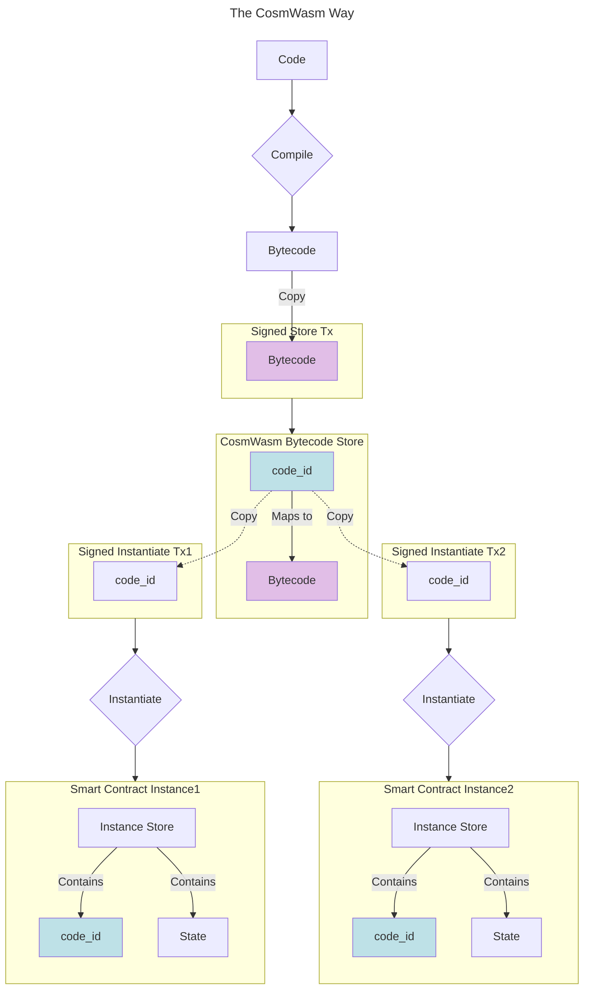

import Tabs from '@theme/Tabs';
import TabItem from '@theme/TabItem';

# CosmWasm concepts overview

The creators of the CosmWasm pieces had the benefit of hindsight and so reused and/or modified concepts found
in other smart contracting systems, and invented others.

## Bytecode lifecycle

At the risk of pushing an open door, a smart contract has an associated **bytecode**, and that bytecode has to be stored somewhere.

If you come from Ethereum, then it sounds natural to you that each smart contract instance has its own bytecode.

<details>
  <summary>Side-note on Ethereum</summary>

  Indeed, with the EVM, the bytecode is stored in the `code` sub-area of the smart contract instance's account.
  Different instances may effectively have the same bytecode, as can be confirmed by their identical bytecode hashes.
  And although identical bytecode may be stored only once at the node level, it still costs users in full for each instance
  to deploy their own bytecode, although to a lesser extent when using bytecode-reuse techniques such as _proxying_.

  ```mermaid
  ---
  config: {}
  title: The Ethereum Way
  ---
  flowchart TB
   subgraph Tx1["Signed Deploy Tx1"]
          BytecodeTx1["Bytecode"]
    end
   subgraph Instance1["Smart Contract Instance1"]
      direction TB
          State1["Instance Store"]
          Bytecode1["Stored Bytecode"]
          Bal1["Eth Balance"]
          Stor1["State"]
    end
   subgraph Tx2["Signed Deploy Tx2"]
          BytecodeTx2["Bytecode"]
    end
   subgraph Instance2["Smart Contract Instance2"]
      direction TB
          State2["Instance Store"]
          Bytecode2["Stored Bytecode"]
          Bal2["Eth Balance"]
          Stor2["State"]
    end
      Tx1 --> Deploy1{"Instantiate"}
      Tx2 --> Deploy2{"Instantiate"}
      Deploy1 --> Instance1
      Deploy2 --> Instance2
      State1 --> Bytecode1 & Bal1 & Stor1
      State2 --> Bytecode2 & Bal2 & Stor2
      Bytecode["Bytecode"] --> Tx1 & Tx2
      Code["Code"] --> Compile
      Compile{"Compile"} --> Bytecode
      style Bytecode1 fill:#E1BEE7
      style BytecodeTx1 fill:#E1BEE7
      style Bytecode2 fill:#E1BEE7
      style BytecodeTx2 fill:#E1BEE7
  ```
</details>

CosmWasm, on the other hand, separates **[storing]** of the bytecode on chain, and **[instantiating]** a smart contract
instance using said bytecode. A stored bytecode is identified by an **id**, which is just a good old [auto-incrementing integer].
Optionally, you can also apply permissions to [control the use] of this stored bytecode, and [change these permissions] at a later stage.
Thereafter, when you instantiate a smart contract instance, you mention the [bytecode id] to use.

Here is what these actions would look like on the command line:

<Tabs>
  <TabItem value="Store bytecode" default>
    Sending a transaction to store a bytecode on-chain looks like this:
      ```sh title="Command line"
      wasmd tx wasm store path/to/compiled_smart_contract.wasm --from ...
      ```

    After the transaction has been validated, you can find the bytecode id in the events, as it looks something like that:
      ```json  title="Transaction event"
      ...
      "type": "store_code",
      "attributes": [
        {
          "key": "code_id",
          "value": "8",
          "index": true
        },
      ]
      ...
      ```
      This tells you that the just-stored bytecode has the id **8**.

  </TabItem>
  <TabItem value="Instantiate smart contract">
    Sending a transaction to instantiate a smart contract looks like this:
      ```sh title="Command line"
      wasmd tx wasm instantiate 8 '{"constructor_field1":...}' --from ...
      ```
    Where **8** is the bytecode id that your instance will use.
    After the transaction has been validated, you can find the smart contract's address in the events, as it looks something like that:
      ```json  title="Transaction event"
      ...
      "type": "instantiate",
      "attributes": [
        {
          "key": "_contract_address",
          "value": "wasm14hj2tavq8fpesdwxxcu44rty3hh90vhujrvcmstl4zr3txmfvw9s0phg4d",
          "index": true
        },
      ]
      ...
      ```
    To understand how the `wasm14hj...` address was created for your smart contract instance, head to the [hello world](./04-hello-world.html) where these is a deep-dive named "How was this address computed?".
  </TabItem>
</Tabs>

A non-negligeable side benefit of having the bytecode stored separately is that when one [smart contract deploys another],
it only needs to mention the bytecode id to use, instead of passing the whole bytecode.
From the smart contract's point-of-view, it would look like this:

```rust title="Pseudo-Rust-code execute return"
  return Ok(response.add_message(
    SubMsg::reply_on_success(      // The eventual reply contains the new address
      WasmMsg::Instantiate {       // Instruct the CosmWasm module
        code_id: 8u64,             // 8 written with 64 bits
        msg: to_json_binary(       // Serialize the instantiate message
          &InstantiateMsg {        // An instantiate message valid for this bytecode
            constructor_field1: …
          })?,
         ...
        },
      ...
    )
  ));
```

If you want to store code and instantiate within the same transaction, you can also do that with [a special message],
although it is not available from the command-line out of the box. Unless you add the command-line bindings yourself, that is.

Once stored, a bytecode cannot be modified. In particular, you cannot upgrade, or migrate, a bytecode as part of an upgrade
of the underlying app chain. On the other hand, a smart contract instance's id of the bytecode in use can either be immutable
or [upgradeable]; you decide at deployment which one it shall be by setting or omitting the [admin].



If you come from Ethereum, you expect a deterministic compilation step, which makes it possible to verify
that a given bytecode is the product of a given code. CosmWasm offers the same tool chain, with a [verifier] for Rust code.

## The module's messages

<details>
  <summary>Refresher on Cosmos SDK's messages</summary>

  The Cosmos SDK defines a [transaction type](https://github.com/cosmos/cosmos-sdk/blob/v0.50.9/types/tx/tx.pb.go#L34-L44):

  ```go title="The Protobuf Tx type compiled into Go"
    type Tx struct {
      // body is the processable content of the transaction
      Body *TxBody `protobuf:"bytes,1,opt,name=body,proto3" json:"body,omitempty"`
      ...
    }
  ```

  Where the [body](https://github.com/cosmos/cosmos-sdk/blob/v0.50.9/types/tx/tx.pb.go#L348-L372) is defined as:

  ```go title="The Protobuf TxBody type compiled into Go"
    type TxBody struct {
      // messages is a list of messages to be executed. The required signers of
      // those messages define the number and order of elements in AuthInfo's
      // signer_infos and Tx's signatures. Each required signer address is added to
      // the list only the first time it occurs.
      // By convention, the first required signer (usually from the first message)
      // is referred to as the primary signer and pays the fee for the whole
      // transaction.
      Messages []*types.Any `protobuf:"bytes,1,rep,name=messages,proto3" json:"messages,omitempty"`
      ...
    }
  ```

  In there, `types.Any` can be any Cosmos module's message, including those for
  [Bank](https://github.com/cosmos/cosmos-sdk/blob/v0.50.9/x/bank/types/tx.pb.go#L37-L41) or
  [CosmWasm](https://github.com/CosmWasm/wasmd/blob/v0.53.0/x/wasm/types/tx.pb.go#L342-L351).
</details>


[storing]: https://github.com/CosmWasm/wasmd/blob/v0.53.0/proto/cosmwasm/wasm/v1/tx.proto#L89
[instantiating]: https://github.com/CosmWasm/wasmd/blob/v0.53.0/proto/cosmwasm/wasm/v1/tx.proto#L113
[auto-incrementing integer]: https://github.com/CosmWasm/wasmd/blob/v0.53.0/x/wasm/keeper/keeper.go#L183
[control the use]: https://github.com/CosmWasm/wasmd/blob/v0.53.0/x/wasm/keeper/keeper.go#L152-L159
[change these permissions]: https://github.com/CosmWasm/wasmd/blob/v0.53.0/proto/cosmwasm/wasm/v1/tx.proto#L273-L283
[bytecode id]: https://github.com/CosmWasm/wasmd/blob/v0.53.0/proto/cosmwasm/wasm/v1/tx.proto#L122
[smart contract deploys another]: https://github.com/CosmWasm/cosmwasm/blob/v2.1.4/packages/std/src/results/cosmos_msg.rs#L207
[a special message]: https://github.com/CosmWasm/wasmd/blob/v0.53.0/proto/cosmwasm/wasm/v1/tx.proto#L387
[upgradeable]: https://github.com/CosmWasm/wasmd/blob/v0.53.0/proto/cosmwasm/wasm/v1/tx.proto#L227
[admin]: https://github.com/CosmWasm/wasmd/blob/v0.53.0/proto/cosmwasm/wasm/v1/tx.proto#L120
[verifier]: https://medium.com/cosmwasm/dont-trust-cosmwasm-verify-db1caac2d335
