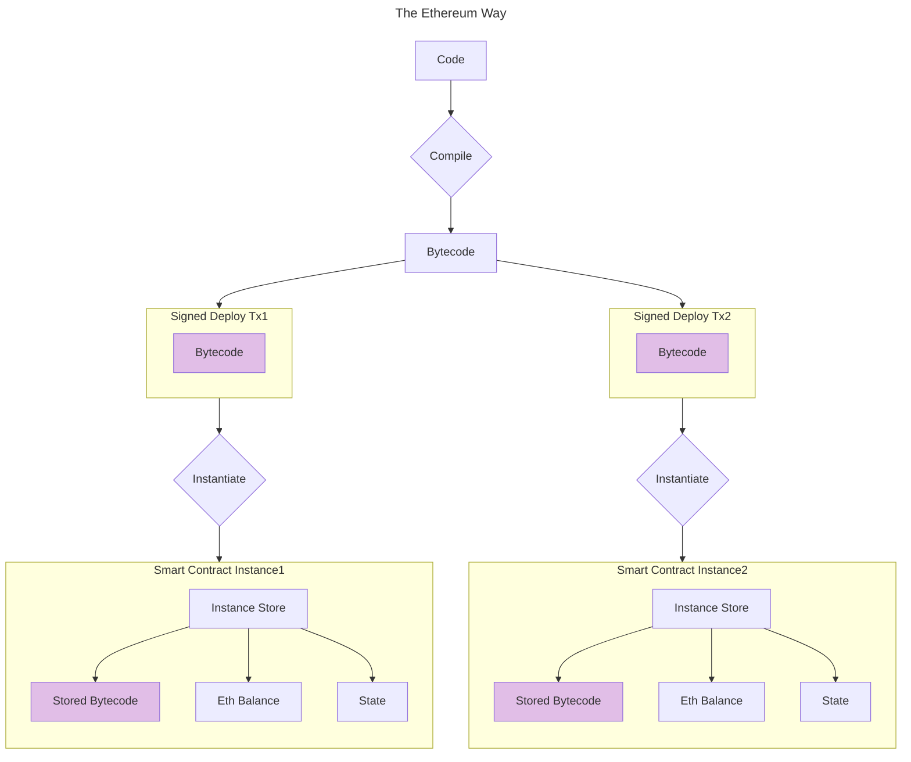
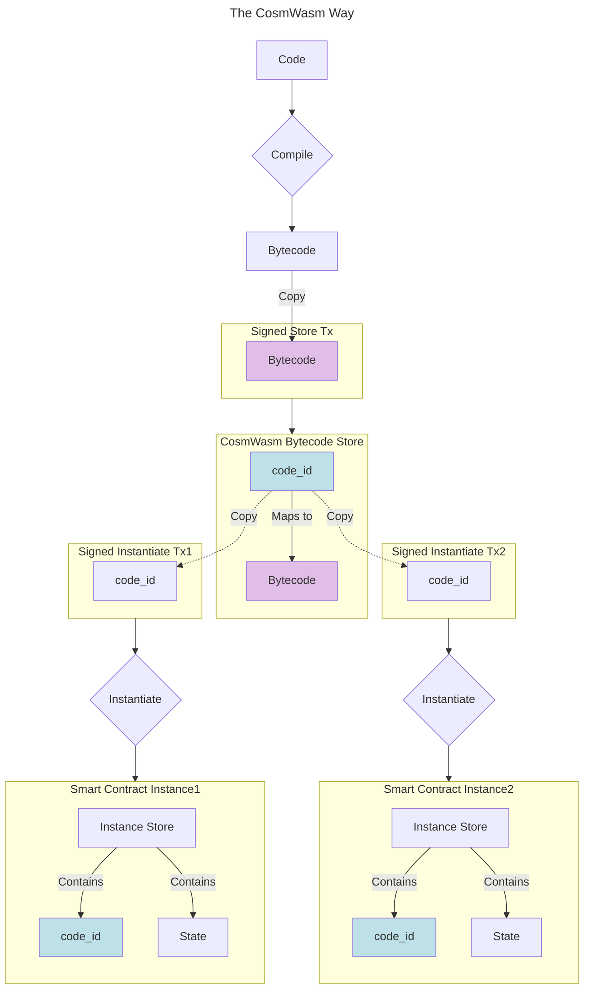
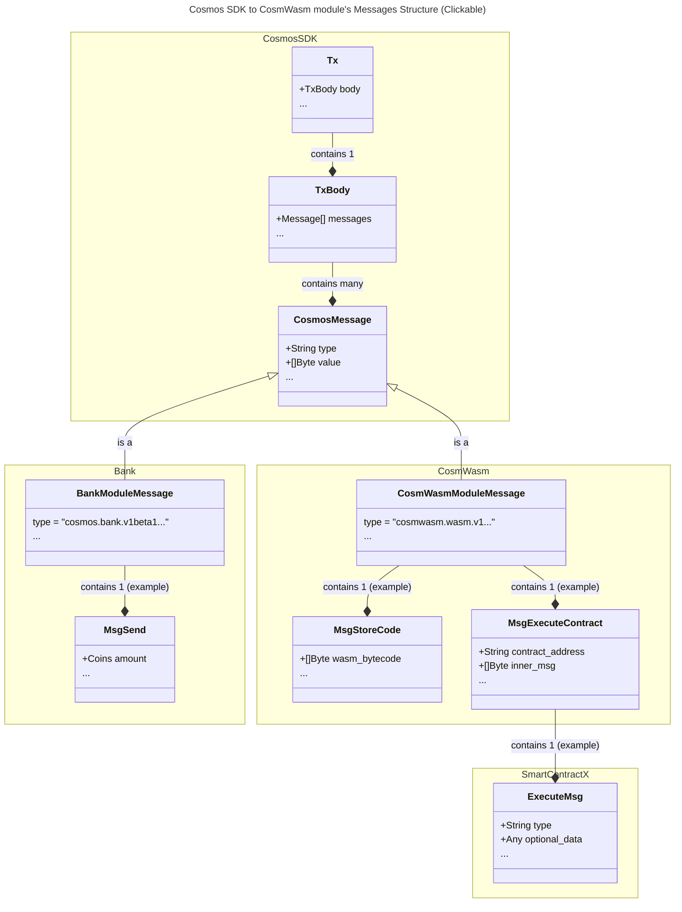
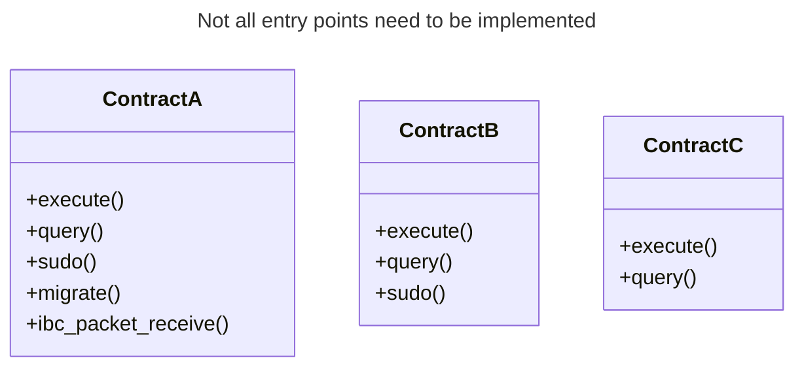
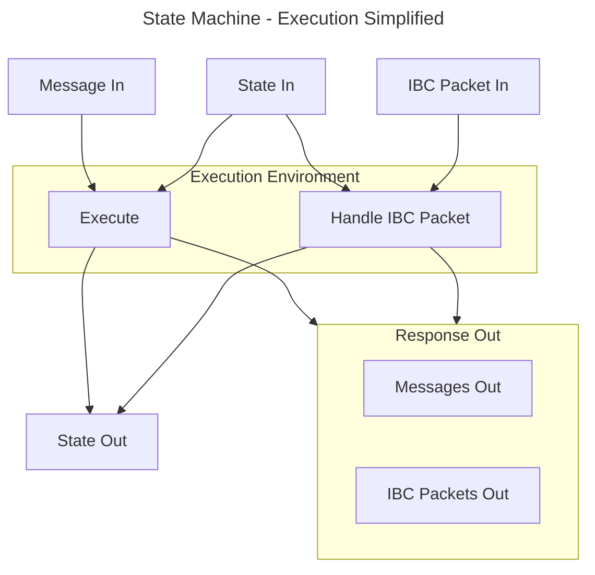
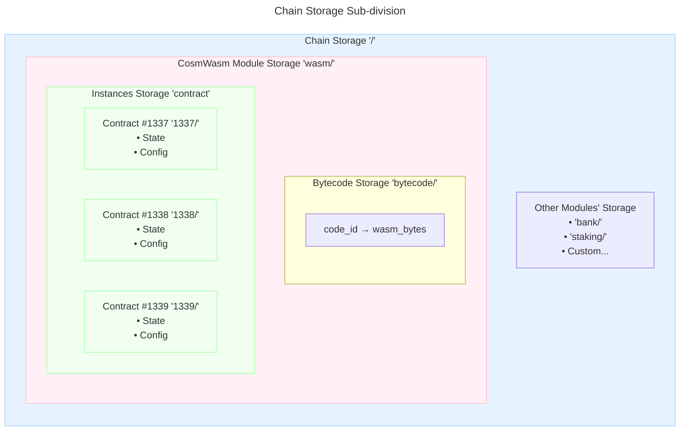
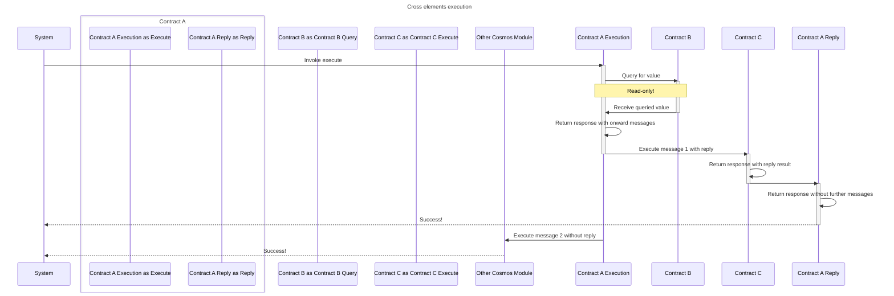

# CosmWasm concepts overview

The creators of the CosmWasm pieces had the benefit of hindsight and so reused and/or modified concepts found
in other smart contracting systems, and invented others.

## Bytecode lifecycle

At the risk of pushing an open door, a smart contract has an associated **bytecode**, and that bytecode has to be stored somewhere.

If you come from Ethereum, then it sounds natural to you that each smart contract instance has its own bytecode.

<Accordion>
<AccordionItem title="Side-note on Ethereum">

Indeed, with the EVM, the bytecode is stored in the `code` sub-area of the smart contract instance's account. Different instances may effectively have the same bytecode, as can be confirmed by their identical bytecode hashes. And although identical bytecode may be stored only once at the node level, it still costs users in full for each instance to deploy their own bytecode, although to a lesser extent when using bytecode-reuse techniques such as _proxying_.



</AccordionItem>
</Accordion>

CosmWasm, on the other hand, **separates [storing](https://github.com/CosmWasm/wasmd/blob/v0.53.0/proto/cosmwasm/wasm/v1/tx.proto#L89)** of the bytecode on chain, **and [instantiating](https://github.com/CosmWasm/wasmd/blob/v0.53.0/proto/cosmwasm/wasm/v1/tx.proto#L113)** a smart contract instance using said bytecode.

A stored bytecode is identified by an **id**, which is just a good old [auto-incrementing integer](https://github.com/CosmWasm/wasmd/blob/v0.53.0/x/wasm/keeper/keeper.go#L183). Optionally, you can also apply permissions to [control the use](https://github.com/CosmWasm/wasmd/blob/v0.53.0/x/wasm/keeper/keeper.go#L152-L159) of this stored bytecode, and [change these permissions](https://github.com/CosmWasm/wasmd/blob/v0.53.0/proto/cosmwasm/wasm/v1/tx.proto#L273-L283) at a later stage. Thereafter, when you instantiate a smart contract instance, you mention the [bytecode id](https://github.com/CosmWasm/wasmd/blob/v0.53.0/proto/cosmwasm/wasm/v1/tx.proto#L122) to use.

Here is what these actions would look like on the command line:

<TabGroup>
    <TabGroupItem title="Store Bytecode" active>
        Sending a transaction to store a bytecode on-chain looks like this:
        <CodeBlock title="Command line">
        ```sh
        wasmd tx wasm store path_to/compiled_smart_contract.wasm \
            --from ...
        ```
        </CodeBlock>
        After the transaction has been validated, you can find the bytecode id in the events, as it looks something like that:
        <CodeBlock title="Transaction event">
        ```json
        ...
        "type": "store_code",
        "attributes": [
            {
                "key": "code_id",
                "value": "8",
                "index": true
            },
        ]
        ...
        ```
        This tells you that the just-stored bytecode has the id `8`.
        </CodeBlock>
    </TabGroupItem>
    <TabGroupItem title="Instantiate Smart Contract">
        Sending a transaction to instantiate a smart contract looks like this:
        <CodeBlock title="Command line">
        ```sh
        wasmd tx wasm instantiate 8 '{"constructor_field1":...}' \
            --from ...
        ```
        </CodeBlock>
        Where `8` is the bytecode id that your instance will use.
        After the transaction has been validated, you can find the smart contract's address in the events, as it looks something like that:
        <CodeBlock title="Transaction event">
        ```json
        ...
        "type": "instantiate",
        "attributes": [
            {
                "key": "_contract_address",
                "value": "wasm14hj2tavq8fpesdwxxcu44rty3hh90vhujrvcmstl4zr3txmfvw9s0phg4d",
                "index": true
            },
        ]
        ...
        ```
        </CodeBlock>
        To understand how the `wasm14hj...` address was created for your smart contract instance, head to the [hello world](./04-hello-world.html) where these is a deep-dive named "How was this address computed?".
    </TabGroupItem>
</TabGroup>

A non-negligeable side benefit of having the bytecode stored separately is that when one [smart contract deploys another](https://github.com/CosmWasm/cosmwasm/blob/v2.1.4/packages/std/src/results/cosmos_msg.rs#L207), it only needs to mention the bytecode id to use, instead of passing the whole bytecode. From the smart contract's point-of-view, it would look like this:

<CodeBlock title="Pseudo-Rust-code execute return">
```rust
return Ok(response.add_message(
    SubMsg::reply_on_success(      // The eventual reply contains the new address
        WasmMsg::Instantiate {     // Instruct the CosmWasm module
            code_id: 8u64,         // 8 written with 64 bits
            msg: to_json_binary(   // Serialize the instantiate message
                &InstantiateMsg {  // An instantiate message valid for this bytecode
                    constructor_field1: ...
                }
            )?,
            ...
        },
        ...
    )
));
```
</CodeBlock>

If you want to store code and instantiate within the same transaction, you can also do that with [a special message](https://github.com/CosmWasm/wasmd/blob/v0.53.0/proto/cosmwasm/wasm/v1/tx.proto#L387), although it is not available from the command-line out of the box. Unless you add the command-line bindings yourself, that is.

Once stored, a bytecode cannot be modified. In particular, you cannot upgrade, or migrate, a bytecode as part of an upgrade of the underlying app chain. On the other hand, a smart contract instance's id of the bytecode in use can either be immutable or [upgradeable](https://github.com/CosmWasm/wasmd/blob/v0.53.0/proto/cosmwasm/wasm/v1/tx.proto#L227); you decide at deployment which one it shall be by setting or ommitting the [admin](https://github.com/CosmWasm/wasmd/blob/v0.53.0/proto/cosmwasm/wasm/v1/tx.proto#L120).



If you come from Ethereum, you expect a deterministic compilation step, which makes it possible to verify that a given bytecode is the product of a given code. CosmWasm offers the same tool chain, with a [verifier](https://medium.com/cosmwasm/dont-trust-cosmwasm-verify-db1caac2d335) for Rust code.

## The module's messages

<Accordion>
<AccordionItem title="Refresher on Cosmos SDK's messages">

The Cosmos SDK defines a transaction type:

<CodeBlock title="The Protobuf Tx type compiled into Go" url="https://github.com/cosmos/cosmos-sdk/blob/v0.50.9/types/tx/tx.pb.go#L34-L44">
```go
type Tx struct {
    // body is the processable content of the transaction
    Body *TxBody `protobuf:"bytes,1,opt,name=body,proto3" json:"body,omitempty"`
    ...
}
```
</CodeBlock>

Where the body is defined as:

<CodeBlock url="https://github.com/cosmos/cosmos-sdk/blob/v0.50.9/types/tx/tx.pb.go#L348-L372" title="The Protobuf TxBody type compiled into Go">
```go
type TxBody struct {
    // messages is a list of messages to be executed. The required signers of
    // those messages define the number and order of elements in AuthInfo's
    // signer_infos and Tx's signatures. Each required signer address is added to
    // the list only the first time it occurs.
    // By convention, the first required signer (usually from the first message)
    // is referred to as the primary signer and pays the fee for the whole
    // transaction.
    Messages []*types.Any `protobuf:"bytes,1,rep,name=messages,proto3" json:"messages,omitempty"`
    ...
}
```
</CodeBlock>

In there, `types.Any` can be any Cosmos module's message, including those for [Bank](https://github.com/cosmos/cosmos-sdk/blob/v0.50.9/x/bank/types/tx.pb.go#L37-L41) or [CosmWasm](https://github.com/CosmWasm/wasmd/blob/v0.53.0/x/wasm/types/tx.pb.go#L342-L351).

</AccordionItem>
</Accordion>

Because the CosmWasm module is a **Cosmos module**, it is called to action with its own queries, messages, and hooks. As examples of Cosmos messages, you have:

* [`MsgStoreCode`](https://github.com/CosmWasm/wasmd/blob/v0.53.0/x/wasm/types/tx.pb.go#L40-L48) is used to store a bytecode inside the CosmWasm bytecode store. When sending it, you just put the bytecode in [`bytes wasm_byte_code`](https://github.com/CosmWasm/wasmd/blob/v0.53.0/proto/cosmwasm/wasm/v1/tx.proto#L96). To see it in action, go to _Store your contract code_ part of the [hello world](./04-hello-world.html#store-your-contract-code).
* [`MsgExecuteContract`](https://github.com/CosmWasm/wasmd/blob/v0.53.0/x/wasm/types/tx.pb.go#L342-L351) is used to instruct the CosmWasm module to call the [_execute_&puncsp;entry point](https://docs.cosmwasm.com/core/entrypoints/execute), a.k.a. function, on the contract instance identified by [`string contract`](https://github.com/CosmWasm/wasmd/blob/v0.53.0/proto/cosmwasm/wasm/v1/tx.proto#L196), and with the entry point arguments serialized in [`bytes msg`](https://github.com/CosmWasm/wasmd/blob/v0.53.0/proto/cosmwasm/wasm/v1/tx.proto#L198-L201).

    <CodeBlock url="https://github.com/CosmWasm/wasmd/blob/v0.53.0/proto/cosmwasm/wasm/v1/tx.proto#L189C1-L209C2" title="tx.proto">
    ```protobuf
    message MsgExecuteContract {
        ...
        // Sender is the that actor that signed the messages
        string sender = 1 [ (cosmos_proto.scalar) = "cosmos.AddressString" ];
        // Contract is the address of the smart contract
        string contract = 2 [ (cosmos_proto.scalar) = "cosmos.AddressString" ];
        // Msg json encoded message to be passed to the contract
        bytes msg = 3 [
            (gogoproto.casttype) = "RawContractMessage",
            (amino.encoding) = "inline_json"
        ];
        ...
    }
    ```
    </CodeBlock>
    To belabor the above point:

    1. `message MsgExecuteContract` is a Cosmos SDK message that the app-chain sends to its own CosmWasm module.
    2. `bytes msg` is the serialized CosmWasm `ExecuteMsg` that the CosmWasm module sends to the `execute` entry point of one of the smart contracts instantiated within the CosmWasm module. Its interpretation is up to the smart contract itself.

    To see it in action, go to _Send a transaction to your contract_ part of the [hello world](./04-hello-world.html#send-a-transaction-to-your-contract). To see how the smart contract handles the `ExecuteMsg`, go to the practical exercise's [First Execute Transaction](./06-first-contract-register.html).

## A smart contract's messages

When it comes to the smart contract messages, the role of the CosmWasm module is:

* To pass these pieces of information onwards to the proper smart contract(s)' entry points,
* and in Rust form (in its WebAssembly form actually),
* with **certain guarantees** about the information passed along.

For instance:

* The smart contract can know with certainty:
  * Among other message-related information, which account sent the message:
    <CodeBlock url="https://github.com/CosmWasm/cosmwasm/blob/v2.1.4/packages/std/src/types.rs#L92-L101" title="MessageInfo's sender">
    ```rust
    pub struct MessageInfo {
        /// The `sender` field from `MsgInstantiateContract` and `MsgExecuteContract`.
        /// You can think of this as the address that initiated the action (i.e. the message). What that
        /// means exactly heavily depends on the application.
        ///
        /// The x/wasm module ensures that the sender address signed the transaction or
        /// is otherwise authorized to send the message.
        pub sender: Addr,
        ...
    }
    ```
    </CodeBlock>
    This sender may be the signer of a transaction or may be another smart contract within the same CosmWasm module (think Ethereum Solidity's `msg.sender`). Your smart contract ought to be agnostic as to which one it is.
  * And, among other block-related information, at [what height](https://github.com/CosmWasm/cosmwasm/blob/v2.1.4/packages/std/src/types.rs#L32) the whole chain is/was at the time of execution:
    <CodeBlock url="https://github.com/CosmWasm/cosmwasm/blob/v2.1.4/packages/std/src/types.rs#L30-L32" title="BlockInfo's height">
    ```rust
    pub struct BlockInfo {
        /// The height of a block is the number of blocks preceding it in the blockchain.
        pub height: u64,
        ...
    }
    ```
    </CodeBlock>
    (Think Ethereum Solidity's `block.height`).
* When a user instructs the CosmWasm module that a smart contract call needs to include a certain **amount of tokens**, the CosmWasm module will take these tokens from the sender and inform the smart contract that it has in fact taken these tokens and credited them to the smart contract's address (Think if there was an Ethereum Solidity's `msg.value` for ERC-20s). The smart contract can then work with this **guaranteed assumption**.
    <CodeBlock url="https://github.com/CosmWasm/cosmwasm/blob/v2.1.4/packages/std/src/types.rs#L105" title="MessageInfo's funds">
    ```rust
    pub struct MessageInfo {
        ...
        /// The funds that are sent to the contract as part of `MsgInstantiateContract`
        /// or `MsgExecuteContract`. The transfer is processed in bank before the contract
        /// is executed such that the new balance is visible during contract execution.
        pub funds: Vec<Coin>,
    }
    ```
    </CodeBlock>
    See [the hello world's](./04-hello-world.html#send-a-transaction-to-your-contract) _Send a transaction to your contract_ to pass funds along with a contract call, and [the practical exercise's](./16-fund-handling.html) _Proper Fund Handling_ to see it implemented in your own smart contract.
* When a smart contract sends a message to another one, and this other contract fails, the originating smart contract does not by default need to roll back any state changes. Instead, the CosmWasm module provides this guarantee of atomicity, unless instructed otherwise. See [the practical exercise's](./14-contract-reply.html) _First Contract Reply Integration_ for an example of the default behavior.
* Additionally, when a smart contract sends a message to another and expects a reply, the payload returned (CosmWasm v2 only) is the same as the one that was sent initially, guaranteed by the CosmWasm module.

The structure from a Cosmos transaction to a message received by a CosmWasm smart contract can be summarized as follows:



## Entry points

As mentioned earlier, a CosmWasm smart contract can be deployed and called with a message, a reply or a query. These concepts are in fact identified in the smart contract interface as different methods called [entry points](https://docs.cosmwasm.com/core/entrypoints).

<Accordion>
<AccordionItem title="If you come from Ethereum">

If you come from the EVM world, a smart contract instantiation is the result of a specific type of transactions where the recipient is missing.

And a smart contract instance has a single point of entry, _behind_ which there is a dispatcher that jumps to the code of the available methods as identified by their respective function selector, or the _fallback_ when the provided selector is not found. In effect, the program counter always starts at `0` in the bytecode.

</AccordionItem>
</Accordion>

A WebAssembly binary instead _exports_ a set of functions that can be called, not unlike what a library would do. The Wasm VM of the CosmWasm module can call such a function. So the purpose of the entry point is to identify a function that should be exported by the WebAssembly compiler, and to confirm that the function signature conforms to the expectations of CosmWasm.

<CodeBlock url="https://github.com/b9lab/cw-my-nameservice/blob/main/src/contract.rs#L26-L32" title="The execute entry point">
```rust
#[cfg_attr(not(feature = "library"), entry_point)]
pub fn execute(
    mut deps: DepsMut,
    env: Env,
    info: MessageInfo,
    msg: ExecuteMsg,
) -> ContractResult {
    ...
}
```
</CodeBlock>

The role of the CosmWasm module is to:

* **Call** the relevant entry points of relevant smart contracts in the relevant situations.
* **Populate** elements such as `env` and `info` with the right values.
* **Verify** and then **pass** on the `msg` or other value coming from elsewhere.
* **Run** the code and **handle** all returns, including potential rollbacks.

If you don't implement a given entry point, then it is closed and attempting to call it results in an error; there are no fallbacks. For instance, if your smart contract does not implement the _sudo_, or the _migrate_, entry point, then these functions are unavailable although your smart contract can still _execute_ and respond to _query_.



## Smart contract execution

### Invocation

When a CosmWasm smart contract is invoked:

* Its code is loaded into memory, either from the node's cache or from the app-chain state.
* It is allocated some configurable amount of memory, typically [32 MB](https://github.com/CosmWasm/wasmd/blob/v0.53.0/x/wasm/keeper/keeper.go#L40) for the stack and the heap.
* It is given access to its state.
* It is given the arguments to run on. These arguments can come from various places, and are not limited to:
  * The message itself in the case of an `ExecuteMsg` or `SudoMsg`,
  * Or from IBC packets if the smart contract is configured for IBC.
* Out of the execution come further messages and IBC packets, plus a possibly updated state.



### Determinism

To achieve consensus on the blockchain, smart contracting platforms need to have deterministic execution, in the sense that non-validating nodes should be able to verify blocks, transactions and state at any later time. If you are familiar with the EVM, you know that all available opcodes are deterministic, and in fact have been created from scratch with determinism as a core requirement.

On the other hand, WebAssembly has a [degree of nondeterminism](https://github.com/WebAssembly/design/blob/main/Nondeterminism.md), and Rust has libraries that give access to nondeterministic aspects, such as CPU time or network I/O. CosmWasm mitigates this issue by not exposing the OS layer to smart contracts.

### DoS protection

In terms of gas, because each metered action in Web Assembly, for instance adding 2 integers, is potentially quite insignificant, the [module meters gas](https://github.com/CosmWasm/wasmd/blob/v0.53.0/x/wasm/keeper/keeper.go#L414-L415) in its own unit: _wasm gas_. At the moment, 1 wasm gas [converts](https://github.com/CosmWasm/wasmd/blob/v0.53.0/x/wasm/types/gas_register.go#L264) to [1/140,000th](https://github.com/CosmWasm/wasmd/blob/v0.53.0/x/wasm/types/gas_register.go#L34) _regular Cosmos gas_. Also, the module does not double-count what is anyway measured at the SDK level, such as accessing the on-chain storage.

<Accordion>
<AccordionItem title="At what step is the smart contract metered?">

A node running a blockchain with the CosmWasm module meters the smart contract when it encounters its code for the first time. After that, it keeps the relevant information in its local cache.

This design was the reason behind [an incomplete patching event](https://medium.com/cosmwasm/the-incomplete-gas-patch-and-why-it-caused-consensus-failures-173547ef02de), where even after the software patch had been applied, the nodes still relied on their old caches, making it look like no upgrade had taken place. Clearing the nodes' caches, fixed that issue.

</AccordionItem>
</Accordion>

### Deterministic invocation

Looking back at the execution arguments, wheverer they come from, they too are always part of the consensus:

* Either because the values are inscribed in a transaction's message,
* Or they have been computed by another smart contract, in the case of cross-contract messages.

### Receiving tokens

A CosmWasm smart contract has an address and as such, you can send tokens to it in the same way that you send tokens to a Cosmos account, with the use of the bank module's `SendMsg`. And unlike what happens in Ethereum, **this action does not trigger code execution**. A smart contract can also send out tokens it owns as part of its execution.

<Accordion>
<AccordionItem title="Code example">

For instance, to prepare the message in order to send tokens using the Rust-to-bank _bindings_ would look like this:

<CodeBlock url="https://github.com/osmosis-labs/osmosis/blob/v25.2.0/cosmwasm/contracts/swaprouter/src/execute.rs#L131-L134" title="Send tokens">
```rust
let bank_msg = BankMsg::Send {
    to_address: sender,
    amount: coins(amount.u128(), token_denom),
};
```
</CodeBlock>

</AccordionItem>
</Accordion>

Of course, it is possible to have code execute in the same transaction by sending a `MsgExecute` alongside the `MsgSend`. However, in this case, both messages are uncorrelated, and the smart contract cannot verify that the adequate transfer has been made. It can only check its own balance, which would be an attack vector.

However, throwing tokens _over the fence_ to the smart contract is the lesser-used way of sending tokens to a smart contract. You should preferably use the [`funds`](https://github.com/CosmWasm/wasmd/blob/v0.53.0/x/wasm/types/tx.pb.go#L350) feature of `MsgExecute`. As mentioned in the messages section above, the CosmWasm module will do the requested fund transfer prior to the execution, so that the smart contract has guarantees that the adequate token transfer has been done to its benefit. See [this hands-on exercise](./16-fund-handling.html) for an example.

On the other hand, for IBC token transfers, it is possible for a smart contract to subscribe to IBC callbacks such that it can be notified as soon as it receives tokens or when the tokens it has sent cross-chain have been received or have timed out.

For a token transfer to be handled by the CosmWasm module, and the smart contract to have guarantees that the token transfer was done, a user has to create a `MsgExecute` message that carries funds information. 

## Smart contract instance storage

As mentioned earlier, bytecode is stored separately from smart contract instances. Now, each instance has its own on-chain storage, separate from each other. It is the role of the CosmWasm module to give access to its **own storage**, and only it, to a smart contract:

* In read/write mode when passing a message or an IBC packet.
* In read-only mode when passing a query.

<Accordion>
<AccordionItem title="A short recall to Ethereum">

If you come from the EVM world, then you know that the EVM has primitive commands like `sstore` that implicitly access the smart contract's storage. The EVM also makes sure that a given smart contract has access to its own storage only, and that it is read-only when accessed during a query, or with a `staticcall` for that matter.

</AccordionItem>
</Accordion>

The WebAssembly VM has no primitives that give access to a hypothetical on-chain storage. Instead, when the CosmWasm module calls one of the smart contract's functions, it passes along a [**context object**](https://github.com/b9lab/cw-my-nameservice/blob/first-execute-message/src/contract.rs#L22) with [fields](https://github.com/b9lab/cw-my-nameservice/blob/first-execute-message/src/contract.rs#L36) and methods that give access to the on-chain storage in read-only or read/write, depending on the context of the call, i.e. [query](https://github.com/b9lab/cw-my-nameservice/blob/first-query-message/src/contract.rs#L48) or [execution](https://github.com/b9lab/cw-my-nameservice/blob/first-query-message/src/contract.rs#L24) respectively.

<TabGroup sync>
    <TabGroupItem title="Query">
        <CodeBlock url="https://github.com/b9lab/cw-my-nameservice/blob/first-query-message/src/contract.rs#L48">
        ```rust
        pub fn query(deps: Deps, ...) ...
        ```
        </CodeBlock>
        `Deps` gives access to immutable, i.e. unmodifiable, state.
    </TabGroupItem>
    <TabGroupItem title="Execution">
        <CodeBlock url="https://github.com/b9lab/cw-my-nameservice/blob/first-query-message/src/contract.rs#L23-L28">
        ```rust
        pub fn execute(deps: DepsMut, ...) ...
        ```
        </CodeBlock>
        `DepsMut` gives access to mutable, i.e. modifiable, state.
    </TabGroupItem>
</TabGroup>

Unsurprisingly, the CosmWasm module arranges each smart contract's storage (think `contract1337/`) within its own module's storage (think `wasm/`), which is itself part of the on-chain storage (think `/`). If you need to, [refresh](https://tutorials.cosmos.network/academy/2-cosmos-concepts/7-multistore-keepers.html) yourself on Cosmos SDK keeper storage.



## Calling out from the smart contract

An interesting feature of smart contracts is that they can **call out to other parts** of the system. CosmWasm smart contracts do too.

### Almost absent reentrancy risk

If you come from the EVM world, you ought to be well acquainted with the risks associated with reentrancy. This risk is facilitated by smart contracts calling each other mid-execution. Eventually, you learn to implement the checks-effects-interactions design pattern as a protection mechanism.

CosmWasm **reduces** the risk of reentrancy with a different design at the platform level: a smart contract instance can only call out to other systems, including other smart contracts, only after it has exited its own invocation. In effect, this forces the _interactions_ part to come last. Of course, it is still on you, the smart-contract developer, to correctly implement the [_checks_](https://github.com/b9lab/cw-my-nameservice/blob/first-multi-test/src/contract.rs#L38-L40) and [_effects_](https://github.com/b9lab/cw-my-nameservice/blob/first-multi-test/src/contract.rs#L42) parts within the function's body. The call mechanism is as follows.

### Invocation mechanism

A successful smart contract execution can return a [list of messages](https://github.com/b9lab/cw-my-collection-manager/blob/main/src/contract.rs#L103) that will be acted upon in turn _within the same transaction_, therefore atomically. For instance, to invoke another smart contract, the invoking smart contract can return a [`WasmMsg::Execute`](https://github.com/b9lab/cw-my-collection-manager/blob/main/src/contract.rs#L83) as part of its returned messages. This sequential design approach ensures that the execution of the invoked smart contract does not insert itself in the middle of the execution of the invoker, all the while preserving guarantees of atomicity.

<CodeBlock url="https://github.com/b9lab/cw-my-collection-manager/blob/main/src/contract.rs#L102-L104">
```rust
pub fn execute(...) -> ContractResult {
    // Checks
    // Effects
    Ok(response.add_submessage(onward_sub_msg))
}
```
</CodeBlock>

Note that if there are nested returned messages, messages are evaluated [depth-first](https://docs.cosmwasm.com/docs/smart-contracts/contract-semantics/#dispatching-messages) as this cleaves to the intent of the caller.

Go to [this exercise](./12-cross-contract.html) to see it in action.

### Reply mechanism

Of course, in some situations, your smart contract may invoke another and expect to receive a value in return, such as a newly created identifier. A fire-and-forget message at the end of the execution will not work. In this case, instead of returning a _simple_ message, you need to wrap the message to [create a sub-message](https://github.com/b9lab/cw-my-collection-manager/blob/main/src/contract.rs#L88-L93). The mechanism for this is to mention, as part of the sub-message, that [a reply is expected](https://github.com/b9lab/cw-my-collection-manager/blob/main/src/contract.rs#L91).

<CodeBlock url="https://github.com/b9lab/cw-my-collection-manager/blob/main/src/contract.rs#L88-L93">
```rust
pub fn execute(...) -> ContractResult {
    // Checks
    // Effects
    let onward_sub_msg = SubMsg {
        id: 1u64,
        msg: CosmosMsg::<Empty>::Wasm(onward_exec_msg),
        reply_on: ReplyOn::Success,
        gas_limit: None,
    };
    Ok(response.add_submessage(onward_sub_msg))
}
```
</CodeBlock>

And to code the **`reply`** entry point (function) such that it handles all expected replies. Your sub-message contains an [id](https://github.com/CosmWasm/cosmwasm/blob/v2.1.0/packages/std/src/results/submessages.rs#L35) for the smart contract to [match the reply](https://github.com/b9lab/cw-my-collection-manager/blob/main/src/contract.rs#L165) to the original sub-message, in order to carry on with the execution. The sub-message also contains a [binary payload](https://github.com/CosmWasm/cosmwasm/blob/v2.1.0/packages/std/src/results/submessages.rs#L49) (in CosmWasm 2.0) that you can use as call context instead of using the storage temporarily, thereby saving gas. Go to [this exercise](./14-contract-reply.html) to see it in action.

<CodeBlock url="https://github.com/b9lab/cw-my-collection-manager/blob/main/src/contract.rs#L166">
```rust
pub fn reply(..., msg: Reply) -> ContractResult {
    match ReplyCode::try_from(msg.id)? {
        1u64 => reply_pass_through(..., msg),
    }
}
```
</CodeBlock>

<HighlightBox type="warn">

Take note of how the `reply` entry point is deliberately different from the `execute` entry point, always with a view of reducing the risk of reentrancy. It is incumbent on you, the developer, to **not re-introduce an attack vector** by moving _checks_ or _effects_ from `execute` to `reply`.

</HighlightBox>

### Composing invocations

Moreover, there is a mechanism to let you, the developer, substitute the returned value of the original `execute` call with the returned value of the corresponding `reply` call. This substitution makes it possible to have the combination of `execute` and `reply` act as as single invocation from the point of view of the original caller.

This lets you achieve cross-contract communication and cooperation, also called _composition_, as with the EVM, but with a reduced risk of reentrancy. This does not eliminate it entirely, though, as you still have to code all of your checks-effects into the body of the `execute` function, and avoid implementing the _effects_ in the `reply` function.

In a sense, with this message-passing architecture, the set of CosmWasm smart contract instances follows the principles of an actor model.

### Cross query

The above is about messages, which have the potential to change contracts' states, and where attacks may happen. On the other hand, if a smart contract only needs a value in a read-only mode, this is a different and safer situation. For this situation, the context object [has the method](https://github.com/b9lab/cw-my-collection-manager/blob/main/src/contract.rs#L95-L96) `deps.querier.query` that lets the smart contract call another synchronously in a read-only mode, where the read-only part is enforced at the VM level.

<CodeBlock url="https://github.com/b9lab/cw-my-collection-manager/blob/main/src/contract.rs#L95-L99">
```rust
let token_count_result = deps.querier
    .query::<NumTokensResponse>(&QueryRequest::Wasm(WasmQuery::Smart {
        contract_addr: collection,
        msg: to_json_binary(&CollectionQueryMsg::NumTokens {})?,
    }));
```
</CodeBlock>

If your smart contract calls others, you can also [include the target's message types](https://docs.cosmwasm.com/docs/architecture/composition#type-safe-wrappers) in order to benefit from compile-time type checking, instead of passing along serialized binaries.

If you want to learn more about learnings from Ethereum, head [here](https://docs.cosmwasm.com/docs/architecture/smart-contracts#lessons-learned-from-ethereum).

### To app-chain modules

Smart contract can also call modules found in the underlying Cosmos SDK app-chain, and vice versa.

So that you don't have to reinvent the wheel, the Rust library offers traits that expose frequently-used Cosmos SDK modules, such as [bank](https://github.com/CosmWasm/cosmwasm/blob/v2.1.4/packages/std/src/results/cosmos_msg.rs#L93-L106). It also has base types that help you create custom messages and queries, called _bindings_, to access custom modules of your app chain.

<CodeBlock url="https://github.com/b9lab/cw-my-collection-manager/blob/main/src/contract.rs#L134-L136" title="Use Bank's MsgSend">
```rust
BankMsg::Send {
    to_address: payment_params.beneficiary.to_string(),
    amount: vec![paid],
}
```
</CodeBlock>

And to mitigate potential mishaps, smart contracts can check at instantiation that the underlying app chain [supports their requirements](https://docs.cosmwasm.com/docs/architecture/composition#checking-for-support).

It is also possible for app-chain modules to call smart contracts. A simple way would be to have an app-chain module's keeper have access to the CosmWasm module's keeper (or message server) so as to call the [`Execute`](https://github.com/CosmWasm/wasmd/blob/v0.53.0/x/wasm/keeper/msg_server.go#L110) or [`SmartQuery`](https://github.com/CosmWasm/wasmd/blob/v0.53.0/x/wasm/keeper/keeper.go#L823) functions on it.

### Sending tokens

You have seen that a smart contract can receive tokens, just as any other on-chain account but also, and preferably, via the `funds` feature of `MsgExecute`. Now because a smart contract can:

* Send a `MsgExecute` as part of its return calls, therefore it can also set the `funds` field so that the target smart contract receives the funds and gets the assurance it received the funds.
* Send a bank `MsgSend` as part of its return calls, therefore it can also send tokens to whatever on-chain account, including another smart contract.

### Tying it together

As an example, if you have Contract A's execution that makes calls to other smart contracts and modules, it could look like this:



## Testing

Testing your smart contracts, as for all your software projects, should be part of your development. Their are different levels of testing, and you benefit from existing tools at each level.

* Rust **unit tests**. They reside in your code, and are tested purely in a Rust way, without even any conversion to WebAssembly. See [this exercise](./05-first-contract.html#unit-testing) for an introduction and [this one](./06-first-contract-register.html#unit-testing) to experience it in more details.
* **Mocked-app tests**, happening all in Rust with the use of the cw-multi-test library to test your contract's interactions with a mocked CosmWasm module. See [this exercise](./08-first-contract-test.html) for an introduction and [this one](./12-cross-contract.html#mocked-app-tests) to experience it in more details.
* Message mocked tests. You create mocks of your SDK modules, against which your smart contracts communicate.

## Client side

You can easily create UIs for your smart contracts, all the more so that they encode their messages in JSON. This JSON encoding also allows you to easily debug messages when the time comes. The CosmJS library offers CosmWasm bindings that you can extend with your own types.
